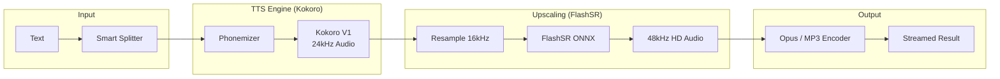

# Kokoro FastAPI - CPU-Optimized TTS Server

<p align="center">
  
</p>

<p align="center">
  <a href="https://huggingface.co/hexgrad/Kokoro-82M"></a>
  
  
  <a href="https://github.com/groxaxo/Kokoro-FastAPI/blob/master/LICENSE"></a>
</p>

---

## 🌟 Overview

**Kokoro FastAPI** is a high-performance, **CPU-optimized** text-to-speech server. It leverages the lightweight [Kokoro-82M](https://huggingface.co/hexgrad/Kokoro-82M) model and integrates **FlashSR ONNX** super-resolution to transform standard 24kHz audio into crystal-clear **48kHz professional-grade speech**—all without needing a GPU.

### Why this project?
While most TTS solutions require heavy GPU resources, Kokoro FastAPI is designed for **efficiency and accessibility**. It is perfect for edge deployments, local assistants, and developers who want premium audio quality on standard hardware.

---

## 🔊 Audio Comparison (24kHz vs 48kHz)

Hear the difference! FlashSR restores high-frequency detail for a more natural and crisp sound.

| Scenario | Voice | Native (24kHz) | Enhanced (48kHz) |
|:---|:---:|:---:|:---:|
| **English Benefits** | `af_heart` | <audio controls src="https://raw.githubusercontent.com/groxaxo/Kokoro-FastAPI/master/examples/audio_samples/english_benefits_24khz.opus"></audio> | <audio controls src="https://raw.githubusercontent.com/groxaxo/Kokoro-FastAPI/master/examples/audio_samples/english_benefits_48khz.opus"></audio> |
| **Spanish Benefits** | `ef_dora` | <audio controls src="https://raw.githubusercontent.com/groxaxo/Kokoro-FastAPI/master/examples/audio_samples/spanish_benefits_24khz.opus"></audio> | <audio controls src="https://raw.githubusercontent.com/groxaxo/Kokoro-FastAPI/master/examples/audio_samples/spanish_benefits_48khz.opus"></audio> |
| **English Technical**| `af_heart` | <audio controls src="https://raw.githubusercontent.com/groxaxo/Kokoro-FastAPI/master/examples/audio_samples/english_technical_24khz.opus"></audio> | <audio controls src="https://raw.githubusercontent.com/groxaxo/Kokoro-FastAPI/master/examples/audio_samples/english_technical_48khz.opus"></audio> |
| **English Jokes** | `af_heart` | <audio controls src="https://raw.githubusercontent.com/groxaxo/Kokoro-FastAPI/master/examples/audio_samples/english_jokes_24khz.opus"></audio> | <audio controls src="https://raw.githubusercontent.com/groxaxo/Kokoro-FastAPI/master/examples/audio_samples/english_jokes_48khz.opus"></audio> |
| **Spanish Jokes** | `ef_dora` | <audio controls src="https://raw.githubusercontent.com/groxaxo/Kokoro-FastAPI/master/examples/audio_samples/spanish_jokes_24khz.opus"></audio> | <audio controls src="https://raw.githubusercontent.com/groxaxo/Kokoro-FastAPI/master/examples/audio_samples/spanish_jokes_48khz.opus"></audio> |

### ✨ Benefits of 48kHz Upscaling
- **Fidelity**: Restores "air" and clarity lost in 24kHz downsampling.
- **Naturalism**: Removes metallic artifacts for a warmer, human tone.
- **Professionalism**: Industry standard for podcasts, audiobooks, and video.
- **Efficiency**: ONNX Runtime ensures this happens in real-time on your CPU.

---

## 📐 Architecture



---

## 🚀 Quick Start

### 1. Installation

```bash
# Clone and enter
git clone https://github.com/groxaxo/Kokoro-FastAPI.git
cd Kokoro-FastAPI

# Setup environment
python3 -m venv .venv
source .venv/bin/activate
pip install -r requirements.txt

# Start Server
./start_server_custom.sh
```

### 2. Environment Variables

| Variable | Default | Info |
|:---|:---:|:---|
| `ENABLE_FLASHSR` | `true` | Set to `false` to disable 48kHz upscaling |
| `USE_GPU` | `false` | Explicitly use CPU (default) |
| `PORT` | `8880` | Server port |

---

## 📡 OpenAI-Compatible API

Kokoro FastAPI is a drop-in replacement for OpenAI TTS.

```python
from openai import OpenAI

client = OpenAI(base_url="http://localhost:8880/v1", api_key="not-needed")

with client.audio.speech.with_streaming_response.create(
    model="kokoro",
    voice="af_heart",
    input="This audio is being upscaled to 48kHz on a CPU in real-time.",
    response_format="opus"
) as response:
    response.stream_to_file("output.opus")
```

---

## 🎤 Voice Palette
Access 67+ voice packs across multiple languages. The server automatically detects the language code based on the voice name.

- **English**: `af_heart`, `af_bella`, `am_adam`, `am_michael`...
- **Spanish**: `ef_dora`, `em_alex`...
- **Others**: French, Japanese, Chinese, and more!

View all available voices at: `GET /v1/audio/voices`

---

## 🌐 Built-in Web Player
Access a modern, sleek web interface at `http://localhost:8880/web/` to test voices, adjust speed, and export high-quality Opus/MP3 files directly.

---

## 🛠️ Credits & License

- **Model**: [Kokoro-82M](https://huggingface.co/hexgrad/Kokoro-82M) by HexGrad
- **Super-Resolution**: [FlashSR](https://huggingface.co/YatharthS/FlashSR) by YatharthS
- **License**: Apache 2.0